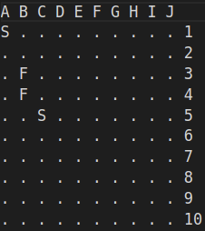

# Programming_Courses

## C Course

## Pascal Classes

### barcos.pas:

Tenemos un juego en el que se sitúan barcos en un tablero para varios jugadores.

El tablero tiene coordenadas desde la A a la J para las columnas y desde el 1 hasta el 10 para las filas, siendo A1 la coordenada de arriba a la izquierda.

* Un barco está definido por el tipo de barco (Submarino, Fragata, Dragaminas), por la posición de su proa (una casilla del tablero) y por su orientación (Horizontal o Vertical).

* **NOTA:** Un barco horizontal tiene la proa a la izquierda. Uno vertical, tiene la proa arriba.

* Los submarinos ocupan 1 casilla; las fragatas, 2; y los dragaminas, 3.

En la entrada, tenemos datos para un número indeterminado de jugadores, y, para cada jugador, tenemos datos de 3 barcos.

Cada jugador empieza en la entrada por la palabra 'jugador' y, tras el último jugador, encontramos la palabra 'fin'.

Para cada barco, tenemos en este orden el tipo de barco, la columna de la proa y la fila de la proa.

*Una entrada de ejemplo es el fichero 'input_barcos.txt'.*

Se desea un programa en Pascal que lea datos de la entrada (input_barcos.txt) y producta la siguiente salida para cada jugador:

Un dibujo del tablero mostrando los barcos del jugador tal y como se muestra en el ejemplo.

Para cada barco, se utiliza la inicial del tipo de barco para marcarlo en la casilla:

